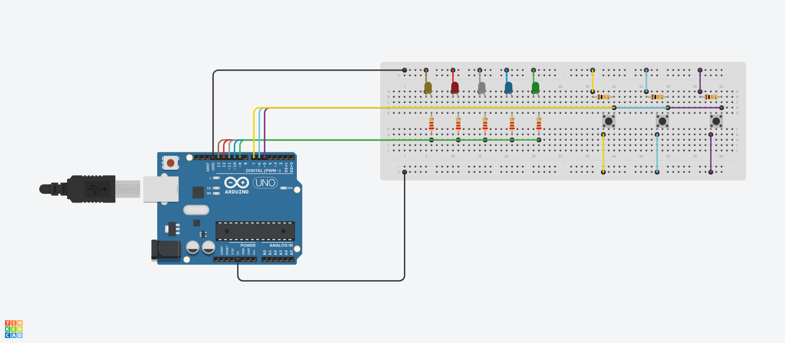
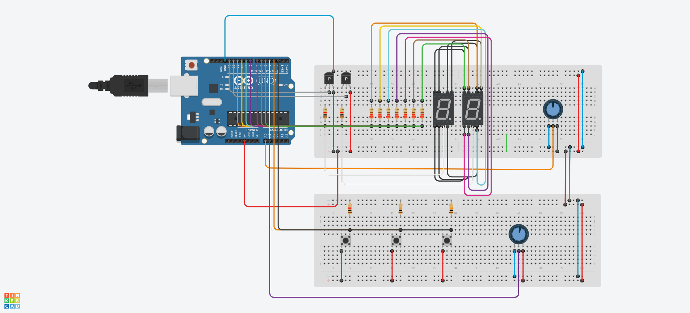
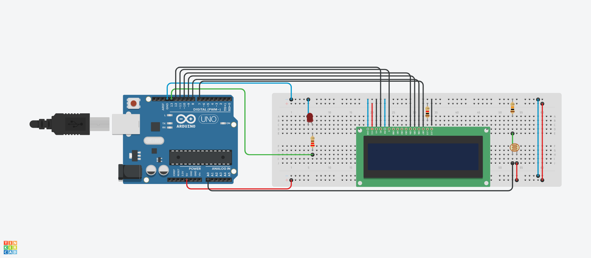
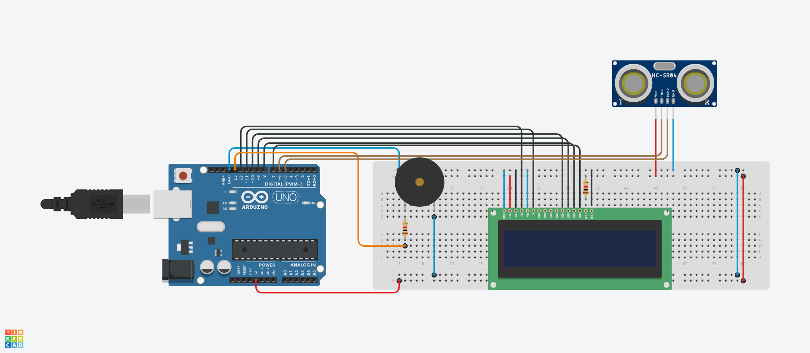
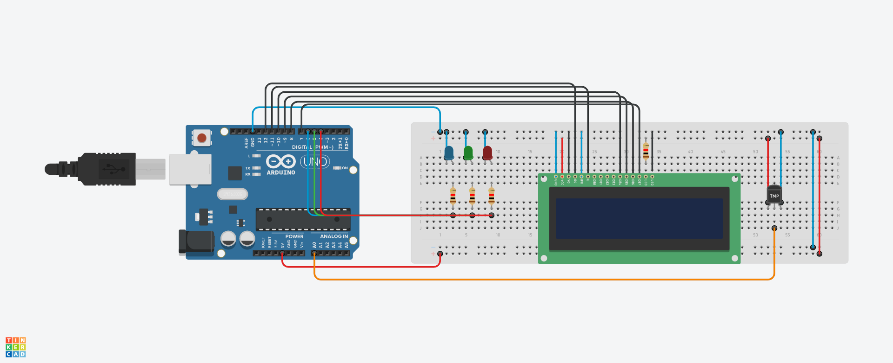
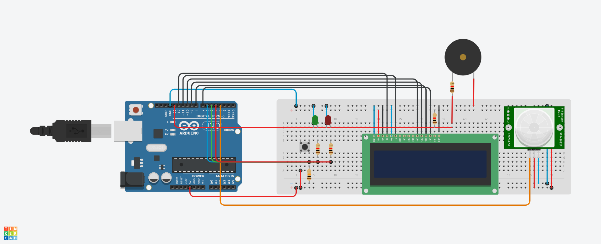

 
 <h2 align="center">Haftalık Ödevler</h2>
 
Bu projeler, Gömülü Sistemler dersinde verilen haftalık ödevler için geliştirilmiştir.

---

### ÖDEV 1 - 5 adet LED'i butonlarla 3 farklı şekilde yakmak.
[Tinkercad üzerinden uygulamaya erişmek için tıklayınız.](https://www.tinkercad.com/things/2Bv68uwMsGA)

---

### ÖDEV 2 - 0-99 arası sayıcı oluşturmak.
[Tinkercad üzerinden uygulamaya erişmek için tıklayınız.](https://www.tinkercad.com/things/hBaAnGTJzfU)

---

### ÖDEV 3.1 - Ortam karanlık olduğunda yanan gece lambası.
[Tinkercad üzerinden uygulamaya erişmek için tıklayınız.](https://www.tinkercad.com/things/1VxzkJ0X3Xy)

---

### ÖDEV 3.2 - Park sensörü.
[Tinkercad üzerinden uygulamaya erişmek için tıklayınız.](https://www.tinkercad.com/things/2nonT9hfrXY)

---

### ÖDEV 3.3 - Sıcaklık değerine göre uyarı veren sistem.
[Tinkercad üzerinden uygulamaya erişmek için tıklayınız.](https://www.tinkercad.com/things/lmTA46y3VdH)

---

### ÖDEV 3.4 - Güvenlik uygulaması.
[Tinkercad üzerinden uygulamaya erişmek için tıklayınız.](https://www.tinkercad.com/things/jB9YJtYYfDs)

---

### ÖDEV 4 - 2 Arduino kullanarak seri haberleşme gerçekleştirmek ve keypad ile sensörlere atanan değere göre motor ile tepki vermek.
[Tinkercad üzerinden uygulamaya erişmek için tıklayınız.](https://www.tinkercad.com/things/1LL5ltj1nSQ)
